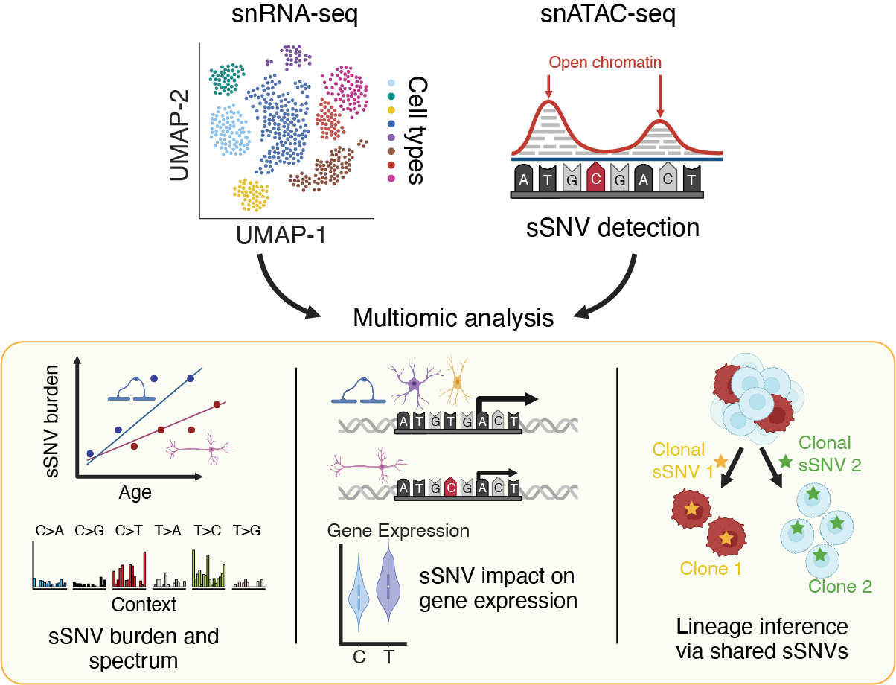

# Duplex-Multiome

Understanding the role of somatic mutations in cancer, aging, and healthy tissues requires high-accuracy methods that can characterize somatic mosaicism across diverse cell types while linking mutations to their functional consequences. Existing approaches for studying cell-type-specific somatic mutations within tissues are often low-throughput and prohibitively expensive. To address these challenges, we developed **Duplex-Multiome**, a novel technology that integrates **duplex consensus sequencing** with **single-nucleus ATAC-seq (snATAC-seq) and RNA-seq (snRNA-seq)** to simultaneously profile somatic single-nucleotide variants (sSNVs) and gene regulatory landscapes from the same nucleus.



## Experimantal Protocol

We selected the 10X Single Cell Multiome ATAC + Gene Expression protocol as a foundation, a widely adopted method for profiling chromatin accessibility and gene expression across diverse tissues. However, a major challenge in applying this protocol to somatic mutation detection is the sequencing error rate, which ranges from 1 in $10^2$ to 1 in $10^3$ on standard sequencing platforms. This poses a great obstacle to somatic mutation calling in 10X Multiome data, especially in non-malignant tissues in which mutation rates are 1 in $10^7$ or even lower. Duplex consensus sequencing, in which products generated from both strands of an initial DNA molecule are sequenced independently, has emerged as the most effective means of reducing sequencing error. We therefore developed Duplex-Multiome, incorporating duplex consensus sequencing through a strand-tagging strategy to expand the capabilities of the 10X Multiome protocol.

Please see **our paper (need a link to the paper in the future)** for the detailed protocol for preparing Duplex-Multiome libraries.


## Computational Pipeline  

Our pipeline processes and analyzes Duplex-Multiome data efficiently. The workflow includes:  

1. **Data Preprocessing**  
    - Read alignment  
    - Multiome data quality control (QC), normalization, batch effect correction, and integration  

2. **Variant Calling**  
    - Detection of somatic SNV candidates using duplex sequencing  
    - Error correction and quality filtering  
    - Recovery of somatic clonal SNVs from stringent filtering  

3. **Multiomic Integration**  
    - Multiome data cell-type annotation  
    - Linking mutations with snATAC-seq and snRNA-seq profiles  

4. **Mutational Pattern Analyses**  
    - Characterization of cell-type-specific mutational burden and spectra  
    - Exploration of clonal mutation landscapes and cell lineages  
    - Profiling the association between clonal mutations and gene expression changes

## Getting Started 

### Set up the computing environment
The analysis requires a SLURM computing cluster.

#### 1. Clone Our GitHub Repository  
To get started, clone this repository to your local machine.  
 
```bash
git clone https://github.com/ShulinMao/Duplex-Multiome.git
```

Only the `pipeline` and `scripts` folders will be used for following analyses. You could delete other
folders if want.

#### 2. Set Up the Environment with Mamba  
We use **Mamba** for environment management to ensure efficient and reproducible installation of dependencies.

If you don't have Mamba installed, you can install it via Conda or follow the instructions from :  

```bash
conda install -n base -c conda-forge mamba
```

Alternatively, you can install Micromamba, a lightweight version of Mamba:
```bash
curl -Ls https://micro.mamba.pm/api/micromamba/linux-64/latest | tar -xvj bin/micromamba
```

Once Mamba is installed, create a new environment for the Duplex-Multiome pipeline:
```bash
cd "path/to/your/repository"
mamba create env create -f ./pipeline/pipeline_preprocessing/environment.yml
mamba activate Duplex-Multiome
```

#### 3. Configure the R environment
We have included **R (v4.0.2)** in the Mamba environment, which is the R version used for all analyses. If you have completed the previous installation steps successfully, R should already be installed on your machine.  

To avoid conflicts between different R packages, we need to set up three separate libraries.  

##### 3.1 Install R packages required for most analyses
Create a folder for the packages in 3.1
```bash
cd "path/to/your/repository"
mkdir Rpackages
```
Start R and specify the package installation path to the newly created directory:
```R
.libPaths(c("path/to/your/repository/Rpackages/"))
```
Next, install the following R packages
- Seurat	v4.0.5
- SeuratDisk	v0.0.0.9019
- Signac	v1.5.0
- GenomicRanges	v1.40.0
- VariantAnnotation	v1.34.0
- future	v1.18.0
- harmony	v0.1.0
- EnsDb.Hsapiens.v86	v2.99.0
- BSgenome.Hsapiens.UCSC.hg38	v1.4.3
- truncnorm v1.0-9
- ggplot2	v3.3.2
- ggpubr	v0.4.0

##### 3.2 Install R packages required for mutational spectrum analysis
Create a folder for the packages in 3.2
```bash
cd "path/to/your/repository"
mkdir Rpackages_sig
```
Start R and specify the package installation path to the newly created directory:
```R
.libPaths(c("path/to/your/repository/Rpackages_sig/"))
```
Next, install the following packages in R
- MutationalPatterns	v3.0.1
- NMF	v0.25
- gridBase	v0.4-7

##### 3.3 Install R packages required for clonal mutation analysis
Create a folder for the packages in 3.3
```bash
cd "path/to/your/repository"
mkdir Rpackages_rstan
```
Start R and specify the package installation path to the newly created directory:
```R
.libPaths(c("path/to/your/repository/Rpackage_rstan/"))
```
Next, install the following package in R
- rstan v2.32.6

#### 4. Install DuplexTools
Our somatic mutation calling workflow relies on **DuplexTools**, a powerful tool developed by Dr. Daniel Snellings from the Walsh Lab. 

Dr. Snellings has provided a detailed README with installation instructions. Please follow his guide available at:  

🔗 **[DuplexTools GitHub Repository](https://github.com/dasnellings/duplexTools/)** or https://github.com/dasnellings/duplexTools/

#### 5. Download reference genome and other required materials
The analyses are performed using GRCh38 reference genome. Since we need to run Cellranger-arc for multiome alignment, we use 10x provided reference (https://www.10xgenomics.com/support/software/cell-ranger-arc/downloads).

We use gnomAD v3.1.2 and dbSNP 147 (common SNPs) in data preprocessing and filtering. While we used these specific versions in our paper, we recommend using the latest versions for your own analyses, as they are continuously updated with improved variant annotations.
```bash
# We downloaded gnomAD data using ANNOVAR
# If you don't have ANNOVAR installed, follow the instructions on https://annovar.openbioinformatics.org/en/latest/user-guide/download/

<path to ANNOVAR>/annotate_variation.pl -downdb gnomad312_genome humandb -buildver hg38
# This will download a file named hg38_gnomad312_genome.txt
```

---
### Bulk WGS data processing
#### 1. WGS data alignment
We perform alignment using BWA with the reference genome GRCh38. Data preprocessing follow the GATK Best Practices (https://gatk.broadinstitute.org/hc/en-us/articles/360035535912-Data-pre-processing-for-variant-discovery). 

Intermediate BAM files from the alignment are sorted using the SortSam function of Picard, and duplicated reads are marked using MarkDuplicates from Picard. Base quality score recalibration is then performed using Genome Analysis Toolkit (GATK).

We provide a template script to conduct bulk WGS data processing under `pipeline/bulk_WGS_data_processing/alignment.sh`. You can explore and modify our scripts. If you need to run the pipeline on your own data, simply update the paths to match your source files.

Note: Running this script is not mandatory. You may use your own pipeline as long as it follows GATK Best Practices.

#### 2. Call high-confidence germline mutations
We use GATK HaplotypeCaller to identify germline mutation candidates from the corresponding WGS BAM file generated after the above step. To obtain high-confidence germline mutations, we:  
1. Extract heterozygous candidates.  
2. Retain candidates that are also present in dbSNP 147 (common SNPs).  

These variants serve as high-confidence germline mutations for a given sample. We will later use these variants to estimate mutation detection sensitivity.  

We also provide a template script to conduct bulk WGS data processing under `pipeline/bulk_WGS_data_processing/call_high_confidence_germline_mutations.sh`. You can explore and modify our script for your own analysis.

Note: As mentioned above, we recommend using the most current version of dbSNP when performing your own analyses.

---
### Multiome data preprocessing
Duplex-Multiome reads are first processed using cellranger-arc with the GRCh38 reference genome and default Cell Ranger parameters. The raw snATAC-seq and snRNA-seq data from cellranger-arc are then analyzed using Seurat and Signac in R. The processing steps include: 1) QC filtering to remove low-quality droplets and doublets/multiplets, 2 normalization, 3) batch effect correction, 4) integration, 5) clustering, and 6) cell type annotation.

You could find the script for multiome data preprocessing under `./pipeline/multiome_data_preprocessing/run_cellranger_arc.sh`. We have also uploaded our codes for implementing basic multiome data analysis (from cellranger's output to cell type annotation) to this repository. They are `./scripts/multiome_data_analysis/multiome_data_preprocessing.R`, `./Duplex-Multiome/scripts/multiome_data_analysis/multiome_data_annotation_transferring.R`, and `./scripts/multiome_data_analysis/subcelltype_analysis/subcelltype_annotation.R`. You can explore and modify our scripts for your own analysis.

---
### Somatic SNV candidates calling
We use Snakemake to manage the calling workflow. We have inclueded it in our Mamba environment.

1. The BAM file of processed ATAC reads from Cell Ranger is first split by cell and strand barcode using samtools.
2. After adding the corresponding strand tags to the BAM files, the two BAM files (strand 1 and strand 2) for each single cell were combined. 
3. Read families (i.e., all reads originating from the same ATAC-tagmented fragment) were next annotated using DuplexTools.
4. Quality filtering is conducted to reduce the risk of misalignment and bacterial DNA contamination.
5. Matched bulk WGS data is next used to filter out germline mutations. The bulk WGS data of other samples and GnomAD are also applied for removing potential contamination of duplex sequencing libraries with DNA from other individuals or environment.

We have a Snakemake file (`./pipeline/pipeline_preprocessing/Snakefile.Duplex_Multiome`) for the above workflow. 

Before running this pipeline, ensure that the following files are prepared:
- Snakemake file
- Config files for your slurm system
- DuplexTools
- CellRanger outputs
- Matched bulk WGS `.bam` file
- High-confidence germline mutation `.vcf.gz` file (see Bulk WGS data processing)
- List of bulk WGS `.bam` files from other samples in your dataset
- GnomAD data in `.vcf.gz` format
- Reference genome
- Black region `.bed` file
- Autosome `.bed` file

A template script for running the Snakemake workflow is provided: `./pipeline/pipeline_preprocessing/run_duplex_multiome_pipeline.sh`. Before executing the pipeline, 
1. update the paths to the required files/software in the template script and specify the strand barcodes used in your libraries;
2. edit the file `./pipeline/slurm_config/cluster-config.yml` for your slurm system.

Once everything is set up, run the pipeline using:
```bash
conda actvate Duplex-Multiome
cd "path/to/your/repository/pipeline/pipeline_preprocessing/"
sbatch ./run_duplex_multiome_pipeline.sh
```

After finishing this step, we could link mutation candidates with their corresponding snATAC-seq and snRNA-seq profiles.

---
### Recovery of somatic clonal SNVs

In addition to ‘private’ sSNVs detected in single cells, Duplex-Multiome also detected clonal sSNVs shared by cells. To enhance the detection of such variants, we modified our variant-calling pipeline. Because errors occurring at the same genomic position across multiple cells are exceedingly rare, variants present in several cells but filtered out due to insufficient supporting reads are likely real. To address this, we optimized the pipeline to include variants shared by three or more cells with at least two supporting reads (denoted as a2s0) as candidate variants. Furthermore, we relaxed our germline variant filtering criteria to avoid excluding somatic mutations arising during early developmental stages. Regarding the risk of incorporating real germline mutations, we introduced a Bayesian filtering approach using the Markov Chain Monte Carlo method as an additional layer of germline variant filtering.

We provide a series of template scripts for somatic clonal SNV detection under `./scripts/clonal_mutation`. Each script follows a numbered order for execution. You could run them with this sequence:
1. Calculate germline mutation VAF: `1_germline_mutation_VAF.R`
2. Collect clonal mutations called by Duplex-Multiome: `2_collect_clonal_mutation.sh`
3. Combine clonal mutations from different samples: `3_clonal_mutation_R`
4. Calculate clonal mutation VAF: `4_clonal_mutation_VAF.R`
5. Run MCMC for germline mutations: `5_germline_mutation_VAF_MCMC_Gaussian.R`
6. Filter clonal mutations with the MCMC model: `6_clonal_mutation_filter_MCMC.R`
7. Perform realignment: please run scripts in `7_realignment`
8. (Optional) Run clone lineage analysis: `8_clone_lineage_analysis.R`
9. (Optional) Perform cell-type-specific clonal mutation analysis: `9_multicell_covered_region_count_cell_type.sh` and `10_clonal_mutation_num_coverage_cell_type.R`

You can explore and modify our scripts for your own analysis.

---
### Mutational Pattern Analyses
Before running this mutational pattern analysis, please have the annotated multiome data prepared.

#### Double-stranded sSNV burden estimation
We provide the template scripts under `./scripts/mutational_burden_analysis`.
1. Generate cell barcode lists for cell types: run `./scripts/multiome_data_analysis/generate_cell_type_cell_barcode_list.R` (To minimize the risks associated with small sample sizes, we only generate list for cell clusters containing more than 200 cells).
2. Estimate error rates in the "duplex error" read families (see details in our paper): `1_estimate_errors_in_duplex_error_read_family.R`.
3. Estimate sSNV burden for each cell type in samples:
    1. Run `2_generate_sbatch_scripts.R` to generate sbatch script for each sample.
    2. Run `run_all_sbatch_scripts.sh` that is a file generated by the above step to run all sbatch scripts.
4. Combine the burden from all samples: `3_summarize_results_cell_type.R`.

#### Double-stranded sSNV spectrum analysis
We provide the template scripts under `./scripts/mutational_spectrum_analysis`.
1. Collect the background 3-mer distribution and its difference from the whole genome: `context_3mer_ratio.R`.
2. Profile the corrected sSNV spectrum for each cell type and conduct signature analysis: `mutation_spectrum_aging_brain_celltype.R`.

#### Single-stranded DNA damage analysis
We provide the template scripts under `./scripts/ssDNA_damage_analysis`.
1. Estimate single-stranded DNA damage burden and spectrum for each cell type in samples:
    1. Run `1_generate_sbatch_scripts.R` to generate sbatch script for each sample.
    2. Run `run_all_sbatch_scripts.sh` that is a file generated by the above step to run all sbatch scripts.
2. Combine the burden and spectrum from all samples:
    - Run `2_single_strand_damage_burden.R` for the burden analysis.
    - Run `3_single_strand_damage_spectrum.R` forthe spectrum analysis.

---
### Demo
We provide a demo to help you get started with the somatic sSNV analysis. The demo is located in the folder `demo` and starts from an example output of CellRanger-arc.

We ramdomly selected four cells from a sample, which is in `demo/CellRanger_output`. This includes 
- `atac_possorted_bam.bam`: bam file of processed ATAC reads 
- `per_barcode_metrics.csv`: table of cell barcodes

Additionally, we generated mock data under `demo/bulk_data`:
- `demo_bulk.bam`: mock bulk WGS bam file
- `demo_germline_variants.vcf.gz`: mock germline variants vcf file
- `bulk_bam_list.txt`: list of bulk BAM files (contains only mock data)

**Important**: These mock files are for the demo only and should not be used in real analyses. In your actual workflow, replace them with paths to your real bulk WGS BAM files and germline VCFs. These are used as a panel of normals to filter out germline vairants and potential cross-sample contamination.

#### Running the demo
The script to run this demo is: `/demo/run_duplex_multiome_mutation_analysispipeline.sh`

Before running the demo, edit the following variables in the script:
```bash
 # reference
reference_genome=/your/path
known_snp=/your/path
masked_region=/your/path
autosomes_bed=/your/path

# Go dir for DuplexTools
go_dir=/your/path
```

In your real analysis, you’ll also need to specify correct paths for:
```bash
# -----------------------------------------------------------------------------
# basic info of samples
dir=$(pwd)
sample_name=Duplex_multiome_demo
base_dir=${dir}/${sample_name}/single_cell && mkdir -p ${base_dir}
tmp=${dir}/${sample_name}/tmp && mkdir -p ${tmp}

# cellranger output directory for the sample
cellranger_dir=${dir}/CellRanger_output

# bulk WGS bam and germline variants called from the WGS data
bulk_bam=/your/path
het_germline_mutations=/your/path
bulk_bam_list=/your/path # bulk WGS bam for other samples in the batch

# reference
reference_genome=/your/path
known_snp=/your/path
masked_region=/your/path
autosomes_bed=/your/path

# Sankemake pipeline and slurm settings
snakefile=/your/path/Snakefile.Duplex_Multiome
# please update your slurm system job submission settings in "cluster-config.yml" in the following folder
profile=/your/path/slurm_config

# Go dir for duplexTools
go_dir=/your/path

# cut-off for filtering out variants present in the bulk WGS bam
max_VAF_clonal_mutation=0.1 # only keep variants with <= 10% VAF shown in the bulk WGS bam

# cell barcode list
sed "s/,/\t/g" ${cellranger_dir}/per_barcode_metrics.csv | awk '{if ($4==1) print}' | awk '{print $1}' > ${base_dir}/per_barcode_metrics.cells

# strand barcode (seperated by "\n")
echo -e "your\nstrand1\nbarcodes" > ${base_dir}/strand1
echo -e "your\nstrand2\nbarcodes" > ${base_dir}/strand2
```

#### Slurm configuration
You should also edit the file `./pipeline/slurm_config/cluster-config.yml` to match your SLURM job submission settings. 

We recommend starting with a dry run to preview job execution. Uncomment the following line in `run_duplex_multiome_mutation_analysispipeline.sh`
```bash
snakemake -s ${snakefile} --profile ${profile} --configfile ${configfile} --directory ${directory} -n # dry run
```
and then execute
```bash
cd demo
sh run_duplex_multiome_mutation_analysispipeline.sh
```
To make a real run, uncomment 
```bash
# if running on a machine with a slurm system
snakemake -s ${snakefile} --profile ${profile} --configfile ${configfile} --directory ${directory} --unlock # unlock a directory if there was a kill signal
snakemake -s ${snakefile} --profile ${profile} --configfile ${configfile} --directory ${directory} --jobs 10 --default-resources "tmpdir='${tmp}'"
```
and the run `run_duplex_multiome_mutation_analysispipeline.sh`.

If you want to run the demo on a machine without a slurm system as a test run, you could uncomment
```bash
# if running on a machine without a slurm system
snakemake -s ${snakefile} --configfile ${configfile} --directory ${directory} --unlock # unlock a directory if there was a kill signal
snakemake -s ${snakefile} --configfile ${configfile} --directory ${directory} --jobs 1 --default-resources "tmpdir='${tmp}'"
```

**Note:** Running on a machine without SLURM is not recommended for processing real datasets due to performance limitations.


## References
1.	Li, H. & Durbin, R. Fast and accurate short read alignment with Burrows-Wheeler transform. Bioinformatics 25, 1754-60 (2009).
2.	Zheng, G.X.Y. et al. Massively parallel digital transcriptional profiling of single cells. Nature Communications 8, 14049 (2017).
3.	Hao, Y. et al. Integrated analysis of multimodal single-cell data. Cell 184, 3573-3587.e29 (2021).
4.	Stuart, T., Srivastava, A., Madad, S., Lareau, C.A. & Satija, R. Single-cell chromatin state analysis with Signac. Nature Methods 18, 1333-1341 (2021).
5.	R Core Team. R: A Language and Environment for Statistical Computing. (2020).
6.	Bais, A.S. & Kostka, D. scds: computational annotation of doublets in single-cell RNA sequencing data. Bioinformatics 36, 1150-1158 (2019).
7.	Danecek, P. et al. Twelve years of SAMtools and BCFtools. GigaScience 10(2021).
8.	Hinrichs, A.S. et al. The UCSC Genome Browser Database: update 2006. Nucleic Acids Research 34, D590-D598 (2006).
9.	Manders, F. et al. MutationalPatterns: the one stop shop for the analysis of mutational processes. BMC Genomics 23, 134 (2022).
10.	Sherry, S.T. et al. dbSNP: the NCBI database of genetic variation. Nucleic Acids Res 29, 308-11 (2001).
11.	Stan Development Team. {RStan}: the {R} interface to {Stan}. (2024).

